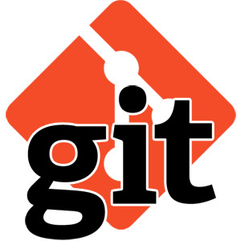

# Git 企业开发者教程

为什么要写这样一个面向企业开发者的Git教程？这个问题也困扰我自己很久。其实我使用git的时间也不短了，但是就和正在阅读本文的每一位一样，常用的基本就是那么几个(git clone, git push)等等。然而git其实有着非常强大的功能，如果不能系统的掌握使用这些功能的技能，我们很容易在一些场景下不知所措，比如以下这些：

* 拉取了共享分支后出现了冲突，怎么合并？
* 到底该不该使用分支？
* 修改了分支上的代码，但是需要临时切换到另外一个分支上工作，可是当前的代码还不能提交，怎么办？
* 团队开始使用拉取请求(Pull Request)了？这是个什么鬼？
* 改了代码，直接运行git commit为啥就不工作呢？
* 怎么样才能把远程分支下载到本地开始工作？
* 变基(rebase)和合并(merge)到底有什么区别？
* 我需要别人分支上的几个改动，怎么才能只获取这几个改动而不合并所有代码？
* 如何比较文件，分支？如何回退代码？
* 我们的代码库很大，如何才能正确切换到Git?
* Git如何能够帮助我们更安全，高效的发布？

在互联网上其实有很多的Git教程，但是太过零散，不成体系，特别是没有考虑到企业开发者所面临的许多具体而实际的问题。我希望通过这套教程，解决企业开发者在使用Git过程中所遇到的诸多疑问，让更多的团队能够享受到Git所带来的良好开发体验，让大家能够真正在大规模复杂项目中将Git的优势发挥出来。我会将我们在给各种企业进行研发管理咨询中所积累的经验以及我们的解决方案融入到这套教程中，相信其中的很多场景一定会对你有所帮助。

这个教程会分成4个部分

## 1. 基础篇

我们一起了解Git的历史，分布式版本控制系统的特点和优势，决定是否git真的适合你。我们也将完成一些初始化的工作，比如：安装和配置Git工具，介绍几个我常用的Git工具，对你的本地Git环境进行初始化操作。最后我们将完成一些常见的Git操作，让你可以开始在日常工作中开始使用Git。如果你还在纠结以上那些问题，不要担心，你必须勇敢的迈出这一步，因为Git已经是全球开发人员公认的最好的版本控制工具，相信你遇到的问题他人都已经遇到过，也一定都有解决的办法。

* [为什么要使用版本控制系统](basic/01-what-is-scm/index.md)
* [Git 分布式版本控制系统的优势](basic/02-git-intro/index.md)
* Git 安装和设置
* 初始化Git存储库(Repo)
* 起步 1 – 创建分支和保存代码
* 起步 2 – 了解Git历史记录
* 起步 3 – 拉取请求 Pull Request 工作机制

## 2. 进阶篇

我们一起了解Git最常用的一系列功能，让你可以开始更加得心应手的完成越加复杂的开发工作，这个时候你会逐渐爱上这个小小的工具，开始欲罢不能；但是你要记住，淹死的都是会游泳的，在你还不够了解一些复杂的功能的时候，不要随意尝试，因为这时你的破坏能力已经足够毁掉你辛苦工作很久的代码了。这一篇中我们会一起针对很多困扰你的问题找到解决方案，让你真正成为一名git高手。为了满足不同用户的口味，我会分别使用命令行和 Visual Studio 两种工具来完成这一篇的所有操作，确保键盘手和鼠标手都能得到满足。

* 使用已有Git Repo提交和共享代码
* 创建新的Git Repo
* 理解Git提交(commit)工作机制
* 使用Git分支(branch)进行工作
* 使用Git推送(push)共享代码
* 使用Git获取/拉取(fetch/pull)更新代码
* 使用拉取请求(Pull Request)进行代码检视
* 使用Git变基(rebase)更新代码
* 使用Git提交拣选(cherry pick)功能在分之间复制改动
* 解决合并冲突(merge conflict)
* 撤销改动
* 忽略文件
* 使用Git历史记录比较文件，分支或者获取历史版本

## 3. Git企业开发者篇

Git起源于开源软件Linux的开发过程，因此在开源社区中广泛流行，也因此很多企业开发者对其敬而远之，感觉无法满足企业开发的诉求。在这一篇中，我们将一起探讨很多企业开发者更加关心的话题，比如：权限管理，Repo分库规划，大规模团队的Git工作流程，与敏捷/瀑布式等不同开发模式的配合，与持续集成/持续部署流水线的配合等对于企业开发非常重要的话题。帮助你将这个最棒的版本控制工具在你复杂的企业开发场景中使用起来。同时我们也将探讨如何在大规模团队中引入git的一些策略性思考。

* 在VSTS/TFS上创建Git仓库
* 迁移已有代码库到Git仓库，如：SVN，TFVC
* Git服务器的权限管理
* Git分库规则
* 大规模团队的Git配置管理流程
* 使用Git支持敏捷/瀑布式开发流程
* Git与持续交付（配置持续集成和持续部署）

## 4. Git分支策略篇

在了解了git强大的分支功能后，如何能够设计出最为高效的分支策略就是困扰很多开发团队的问题。在这一篇中我们将专门探讨如何针对不同项目/产品的交付方式和团队结构设计不同的分支策略，满足各种规模团队的不同诉求。

* Git 分支策略设计的原则，调试单元，部署单元，测试单元
* Git 与团队结构，产品/项目发布特性，产品生命周期
* Git 拉取请求与可靠持续交付
* Git 分叉(Fork)与分支(Branch)的区别
* 传统分支模式与特性分支模式的比较
* 特性分支+拉取请求+质量门模式
* 混用分叉(fork)与特性分支(feature branch)

## Git常见问题

在使用Git的过程中我们经常会遇到各种问题，这里对我所遇到的问题进行了一个汇总，方便大家查找。在Git企业开发者教程中，我们将在遇到这些问题的时候直接引用这里的链接。

* [解决Git在Windows上使用http/https无法认证的问题](faqs/01-git-on-windows-issues/index.md)
* [如何修改 gitconfig 和常用配置](faqs/02-gitconfig/index.md)
* [如何定位Git执行过程中的问题](faqs/03-debugging-git/index.md)

在这个教程中，我们将使用 Visual Studio Team Services (VSTS) /Team Foundation Server(TFS) 作为我们的Git服务器。为什么不采用GitHub？这一定是你在想的问题！因为这一系列文章的目标用户是企业开发者，而VSTS提供了企业开发者所需要的全生命周期管理能力，我们在4个篇章逐渐深入的过程中你就会体会到这种端到端工具所带来的好处。我一直都认为，一个企业的软件交付效率中最重要的环节永远的是编码过程，因为这才是软件交付的核心，没有任何的管理实践可以替代开发人员自由自在的编写代码所带来的效率提升。当然，如果你不使用VSTS/TFS也完全不必担心，这个教程中的大多数内容同时适用于任何Git服务器，包括GitHub, GitLab, BitBucket等大家常用的环境。

本系列教程将使用Markdown编写，同时发布于 DevOps 文档中心, DevOps公众号和博客，并且文档和所有的示例代码都将通过GitHub开源提供给社区。